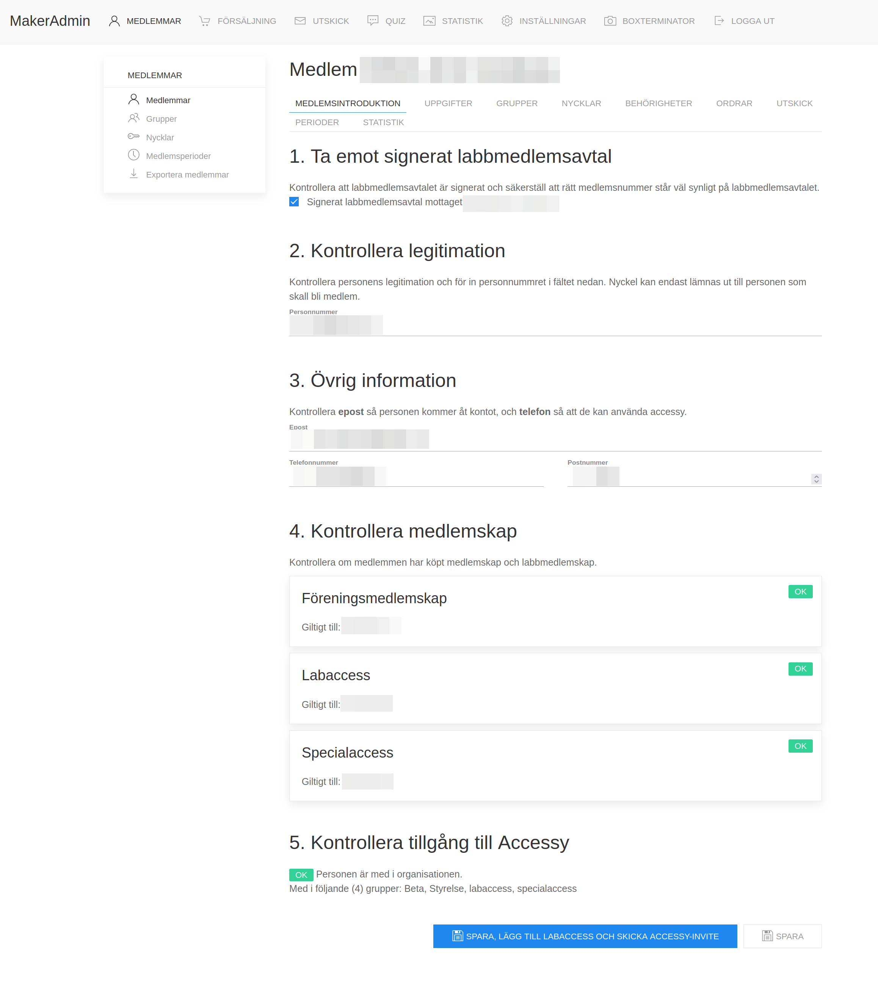

# How to finalize registration

Who is this guide for: admin

Users are free to register to makerspace.se, but they are only able to
access our premises if they have attended a member introduction and
signed our member's contract.

Once they have done so, the person responsible for the introduction
needs to finalize their registration.

You will need the ID of the member (any documentation that shows their name and a
personal identification number).

## How to finalize in Makeradmin

On makeradmin, go to the _Members_ (_Medlemmar_) tab.

If they have not register themselves already, see [how to register a
new member](register-new-member.md).

Search for the member in the search bar using their name. Click on the
number on the left most column to open their member page.

You will be met with a screen asking if they have signed the member's
contract and that the member number of the member matches the one you
have on the bottom left of the contract. Click the checkbox to
continue.

Fill then the necessary information to continue.

Then click on _Spara_ (_Save_) to save the information.

If the person has paid for Labacess, it is also possible to activate
their labaccess immediatly by clicking the button _Spara, lägg till
labaccess och skicka accessy-invite_ (_Save, activate the labaccess
and send the invite to accessy_). If not done, it will activate
automatically the day after.

## Activate their labaccess at a later stage

If a new member wants their labaccess to be activated at a later date,
you need to first activate their labaccess, and then change it's
validity period. To change the validity of the labaccess, go to
_Perioder_, and edit the Period in _Labaccess_ to start at a later
date.

