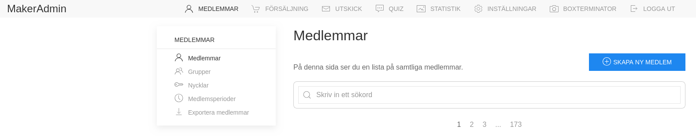

# How to register a new member

Who is this guide for: admin

You might need to register a member manually, if for example they
attended a member introduction and signed our member contract but did
not register themsevles first.

## Add a new member

On makeradmin, go to the _Members_ (_Medlemmar_) tab.
Click on the _+ Skapa Ny Medlem_ button on the top right.

## Input their information

On the next page, you get a form where you can add the member's
information:

- Personal number (Personnummer)
- First Name\*
- Last Name
- Email address\*
- Telephone number
- Address

It is important that their email address are correct:
this is their username to login later on.

Click save to add the new member
